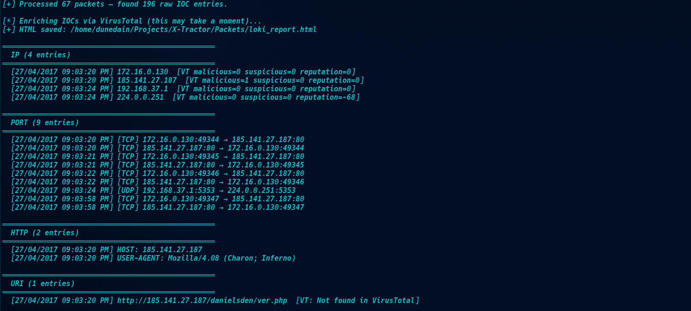
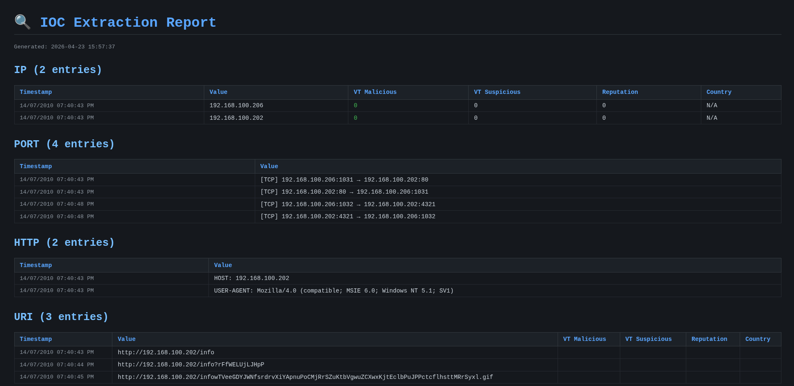
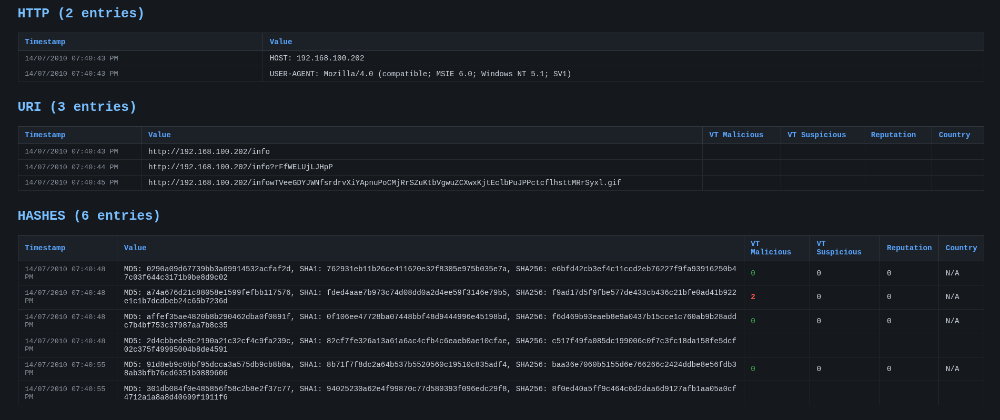
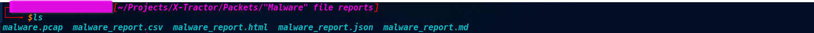

# 🔍 X-Tractor

A command-line tool for extracting **Indicators of Compromise (IOCs)** from PCAP files, with optional **VirusTotal enrichment** for threat intelligence.

Built for SOC analysts and incident responders who need to quickly triage network captures.

---

## Features

- **Multi-protocol extraction** — IP, DNS, SSL/TLS SNI, HTTP, FTP, SMTP, ports, payload hashes, URIs
- **VirusTotal integration** — automatically enrich IPs, domains, URLs, and file hashes with reputation data
- **Multiple export formats** — CSV, JSON, Markdown, HTML (dark-themed report)
- **Deduplication** — remove duplicate IOCs across all or specific categories
- **Input validation** — checks PCAP file exists, is readable, and non-empty before processing
- **Verbose mode** — detailed packet-level logging for debugging

---

## Installation

```bash
git clone https://github.com/VelvetB1te/X-Tractor.git
cd X-Tractor
pip install -r requirements.txt
```

**requirements.txt:**
```
pyshark
requests
```

> ⚠️ `pyshark` requires [Wireshark/tshark](https://www.wireshark.org/download.html) to be installed on your system.

---

## Usage

### Basic extraction

```bash
# Extract IPs and DNS from a PCAP
python3 tractor.py capture.pcap --ip --dns

# Extract everything
python3 tractor.py capture.pcap --all

# Extract HTTP traffic (hosts, URIs, User-Agents, response codes)
python3 tractor.py capture.pcap --http --verbose
```

### Deduplication

```bash
# Deduplicate all categories
python3 tractor.py capture.pcap --all --dedup

# Deduplicate IPs only
python3 tractor.py capture.pcap --ip --dns --dedup-ip

# Deduplicate DNS/SSL domains only
python3 tractor.py capture.pcap --dns --ssl --dedup-domain
```

### VirusTotal Enrichment

```bash
# Using a flag
python3 tractor.py capture.pcap --ip --dns --vt-enrich --vt-key YOUR_API_KEY

# Using an environment variable (recommended)
export VT_API_KEY=your_api_key_here
python3 tractor.py capture.pcap --all --dedup --vt-enrich
```

> 🔑 Get a free VirusTotal API key at [virustotal.com](https://www.virustotal.com)  
> Free tier: 4 requests/minute, 500 requests/day

### Export reports

```bash
# Export to all formats
python3 tractor.py capture.pcap --all --dedup --csv --json --md --html

# Silent mode (no console output, just save files)
python3 tractor.py capture.pcap --all --html --quiet
```

---

## CLI Reference

| Flag | Description |
|------|-------------|
| `--ip` | Extract source/destination IP addresses |
| `--dns` | Extract DNS query names |
| `--ssl` | Extract SSL/TLS SNI hostnames |
| `--http` | Extract HTTP hosts, URIs, User-Agents, response codes |
| `--ftp` | Extract FTP commands |
| `--smtp` | Extract SMTP parameters and email addresses |
| `--port` | Extract TCP/UDP port connections |
| `--hashes` | Hash raw packet payloads (MD5, SHA1, SHA256) |
| `--uri` | Heuristic URI extraction from raw packets |
| `--all` | Enable all filters above |
| `--dedup` | Deduplicate all IOC categories |
| `--dedup-ip` | Deduplicate IPs only |
| `--dedup-domain` | Deduplicate DNS/SSL domains only |
| `--vt-enrich` | Enrich IOCs with VirusTotal data |
| `--vt-key KEY` | VirusTotal API key (or set `VT_API_KEY` env var) |
| `--csv` | Save CSV report |
| `--json` | Save JSON report |
| `--md` | Save Markdown report |
| `--html` | Save dark-themed HTML report |
| `--verbose` | Show detailed processing info |
| `--quiet` | Suppress console output |

---

## Screenshots

### Console Output — Live VirusTotal enrichment


### HTML Report — Dark theme with colour-coded VT scores



### Generated Report Files


---

## Example Output

### Console
```
══════════════════════════════════════════════════
  IP (2 entries)
══════════════════════════════════════════════════
  [27/04/2017 09:03:20 PM] 172.16.0.130    [VT: malicious=0 suspicious=0 reputation=0]
  [27/04/2017 09:03:20 PM] 185.141.27.187  [VT: malicious=1 suspicious=0 reputation=0]

══════════════════════════════════════════════════
  HTTP (2 entries)
══════════════════════════════════════════════════
  [27/04/2017 09:03:20 PM] HOST: 185.141.27.187
  [27/04/2017 09:03:20 PM] USER-AGENT: Mozilla/4.08 (Charon; Inferno)

══════════════════════════════════════════════════
  URI (1 entries)
══════════════════════════════════════════════════
  [27/04/2017 09:03:20 PM] http://185.141.27.187/danielsden/ver.php
```

### HTML Report

Dark-themed table with colour-coded VirusTotal scores:
- 🔴 Red = malicious detections
- 🟡 Yellow = suspicious detections
- 🟢 Green = clean

---

## Use Cases

- **Incident Response** — quickly triage a suspicious PCAP from an endpoint
- **Malware Analysis** — extract C2 IPs and domains from a malware sandbox capture
- **Threat Hunting** — bulk-check IOCs against VirusTotal
- **CTF / Blue Team challenges** — automate IOC extraction from challenge PCAPs

---

## Author

Built by [VelvetB1te](https://github.com/VelvetB1te) — SOC analyst.

- LinkedIn: [Tamerlan Shabanov](https://www.linkedin.com/in/tamerlan-shabanov-9b1ab1166)
- GitHub: [VelvetB1te](https://github.com/VelvetB1te)

---

## License

This project is licensed under the MIT License.  
See the [LICENSE](LICENSE) file for full details.
